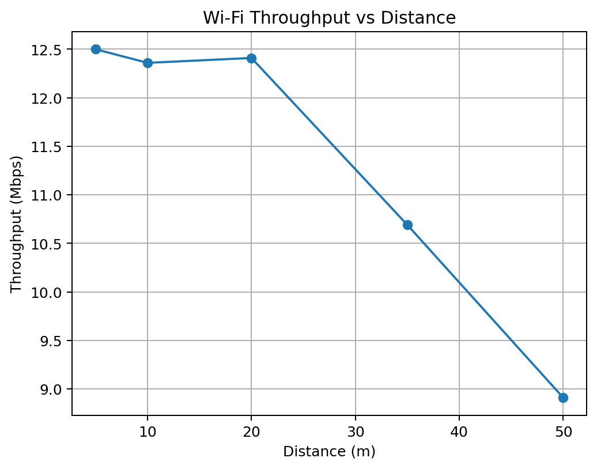
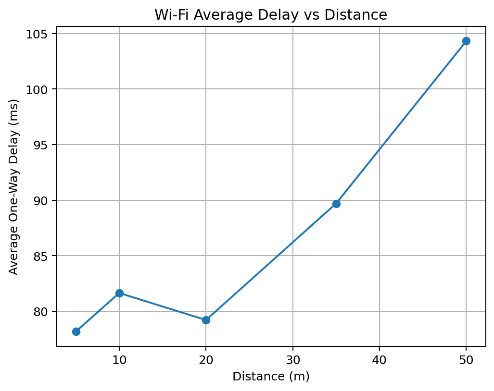

# Wi-Fi Distance Performance Study (ns-3)

This project demonstrates a **basic ns-3 simulation** of a Wi-Fi network and analyzes how **distance** affects performance metrics such as **throughput**, **latency**, and **packet loss**.

It was created as a compact showcase of:
- **ns-3 event-driven simulation** in C++  
- Wireless system fundamentals (802.11)  
- Data analysis and visualization with Python (pandas + matplotlib)  

---

## Results

### Throughput vs Distance

### Delay vs Distance

The results show that throughput decreases with distance while delay increases.

